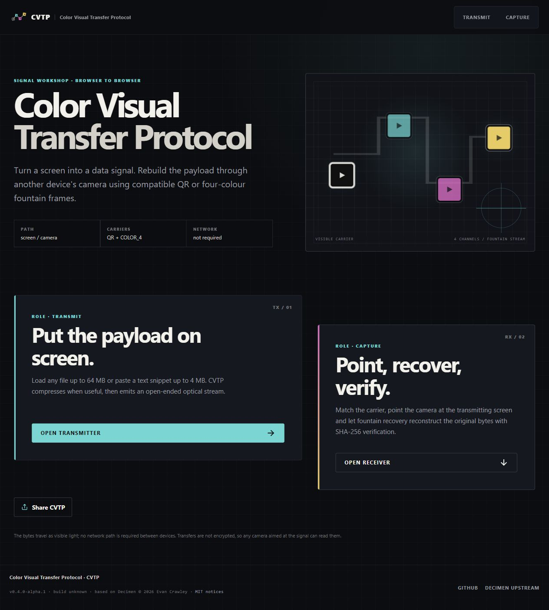

# Color Visual Transfer Protocol

**CVTP** moves a file between two devices using only a screen and a camera.
The transmitter displays an endless stream of optical frames; the capture
device reconstructs the payload from any sufficient set of frames. There is no
backend, account, pairing step or network path between the two devices. The
payload travels as light.

<p align="center">
  
</p>

## Status

CVTP provides two visual carriers over the same verified container and LT
fountain stream:

- **QR_LEGACY** keeps the Decimen v0.3.0 QR wire format byte-compatible and
  interoperable with the upstream application.
- **COLOR_4/1** is CVTP's experimental four-colour carrier. Its ROBUST profile
  targets reliable reconstruction at 0.5–1 m and up to 15°. It is not claimed
  to be faster than QR until repeatable physical measurements show that.

Files up to 64 MiB and text snippets up to 4 MiB are supported. Filename and
media type are preserved, gzip is used only when it helps, and SHA-256 is
verified before the result is offered.

This repository incorporates Decimen Optical Transfer at commit
[`f0c49e92`](https://github.com/bashalarmistalt/decimen-optical-transfer/commit/f0c49e92d50366c6867759800dd962b70d840a1a).
Its original copyright and MIT license are preserved in [NOTICE](NOTICE.md).
CVTP's product identity, COLOR_4 carrier and signal-workshop interface are
maintained by this project.

Neither carrier is encrypted: any camera pointed at the transmitting display
can record the stream. The channel is offline, not confidential. See
[privacy](docs/user/privacy.md).

## Carriers

- **QR (legacy):** the original `qrcode` renderer and self-hosted
  `zxing-wasm` reader. DCF2, the 20-byte frame header and LT fountain stream
  remain unchanged.
- **COLOR_4 robust:** a 72×85 K/C/M/Y data grid with 6×RS(255,223), CRC32C,
  interleaving and deterministic whitening.
- **COLOR_4 experimental:** a 120×119 grid with 14×RS(255,239), available as a
  Labs profile until it passes the physical acceptance matrix.

Both carriers recover the exact same `packFrame` bytes and feed the unchanged
fountain decoder. There are no sequential chunks, start frames or end frames;
a receiver can join an active stream at any point.

## Documentation

**Using CVTP** — [quick start](docs/user/quick-start.md) ·
[transmitting](docs/user/sending.md) · [capturing](docs/user/receiving.md) ·
[Debug Vision](docs/user/debug-vision.md) ·
[troubleshooting](docs/user/troubleshooting.md) ·
[install & offline](docs/user/install-and-offline.md) ·
[privacy](docs/user/privacy.md)

**How it works** — [architecture](docs/technical/architecture.md) ·
[core protocol](docs/technical/protocol.md) ·
[COLOR_4/1 specification](docs/technical/color4-protocol.md) ·
[benchmark method](docs/technical/benchmarking.md) ·
[platform quirks](docs/technical/platform-quirks.md) ·
[build & release](docs/technical/build-and-release.md)

## Run locally

Requires **Node.js 22**.

```powershell
cd C:\Users\Usuario\Documents\Code\Typescript\color-visual-transfer-protocol
npm ci
npm run dev
```

Open:

- `https://localhost:5173/`
- `https://localhost:5173/send/`
- `https://localhost:5173/receive/`
- on a phone, `https://<IP-LAN>:5173/receive/`

Accept the self-signed development certificate once on each device. Both
devices must select the same carrier and, for COLOR_4, the same palette.

Production build and preview:

```powershell
npm run build:all
npm run preview
```

Complete validation:

```powershell
npm test
npm run typecheck
npm run build:all
npm run test:e2e:install
npm run test:e2e
npm run test:stress
```

`test:e2e:install` is needed once per machine. The 64 MiB stress test may use
roughly 700 MiB of RAM.

## Similar projects

- [mohankumarelec/airgapped-qr-code-transfer](https://github.com/mohankumarelec/airgapped-qr-code-transfer):
  browser-based QR transfer with compression and sequential chunking.
- [divan/txqr](https://github.com/divan/txqr): animated QR and fountain codes in
  Go.
- [sz3/libcimbar](https://github.com/sz3/libcimbar): a high-density custom
  colour code for this channel.

CVTP uses [node-qrcode](https://github.com/soldair/node-qrcode),
[zxing-wasm](https://github.com/Sec-ant/zxing-wasm) and OpenCV.js. The QR
compatibility core derives from Decimen Optical Transfer by
[Evan Crawley (Bash Alarmist)](https://www.linkedin.com/in/evan-crawley).

## License

MIT — see [LICENSE](LICENSE) and [NOTICE](NOTICE.md).
